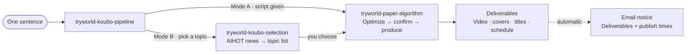

<p align="center">
  
</p>

<p align="right"><sub>English · <a href="README.zh-CN.md">简体中文</a></sub></p>

---

**TryWorld · A Collection of Codex Skills.**

Five skills, one content pipeline: topic selection, scriptwriting, video production, deep research, and long-form writing. Each works on its own; together they form a complete voiceover workflow — from "what should I make this week" to delivered videos, automatic email notices, and a four-platform publishing schedule.

## Skills

| No. | Skill | Role | Deliverables |
|---|---|---|---|
| 01 | [tryworld-koubo-pipeline](skills/tryworld-koubo-pipeline/) | Voiceover entry point, auto-routing | Full delivery · email notice |
| 02 | [tryworld-paper-algorithm](skills/tryworld-paper-algorithm/) | Paper Algorithm video production | Video · covers · titles |
| 03 | [tryworld-koubo-selection](skills/tryworld-koubo-selection/) | AI-news topic selection | 3–8 candidate topics |
| 04 | [tryworld-hv-analysis](skills/tryworld-hv-analysis/) | Horizontal–Vertical deep research | PDF research report |
| 05 | [tryworld-writer](skills/tryworld-writer/) | WeChat long-form writing | Finished article |

## Workflow



For the video pipeline, remember one entry: `$tryworld-koubo-pipeline`. `tryworld-hv-analysis` and `tryworld-writer` are standalone.

## Design System · Paper Algorithm

Paper is the stage, ink is the text, vermillion is the accent, the seal is the signature.

| Swatch | Value | Role |
|---|---|---|
| Paper | `#F4EFE4` | Background |
| Ink | `#1C1916` | Text & lines |
| Vermillion | `#C0452F` | The only accent |
| Ink Blue | `#2E5E8C` | Secondary notes |

Type: Noto Serif SC · LXGW WenKai · monospace. Motion: ink drop, brush stroke, seal stamp. A vermillion「试界原创」seal stays in the top-right corner throughout.

## Install

Each skill folder is self-contained. Copy it into your local skills directory:

```powershell
Copy-Item -Path .\skills\* -Destination "$env:USERPROFILE\.codex\skills" -Recurse
```

`~/.agents/skills` works on other hosts too. Then just say: "Make me a TryWorld voiceover video."

## Layout

```text
tryworld-skills/
├── assets/                  # hero, license badge
├── README.md                # English
├── README.zh-CN.md          # 简体中文
├── LICENSE                  # CC BY-NC 4.0
└── skills/
    ├── tryworld-koubo-pipeline/
    ├── tryworld-paper-algorithm/
    ├── tryworld-koubo-selection/
    ├── tryworld-hv-analysis/
    └── tryworld-writer/
```

## License

Creative Commons Attribution-NonCommercial 4.0 International (CC BY-NC 4.0): share and adapt freely for **non-commercial** purposes, with attribution. Commercial use is not permitted. Full terms: [LICENSE](LICENSE).

[](https://creativecommons.org/licenses/by-nc/4.0/)

---

<p align="center"><sub>TryWorld · Making AI clear for everyone — set in Paper Algorithm · MMXXVI</sub></p>