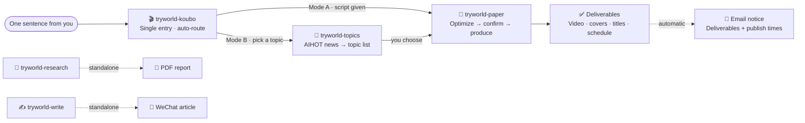

<p align="center">
  
</p>

<div align="center">
  <b style="font-family:Georgia,'Noto Serif SC','Songti SC','SimSun',serif; font-size:18px; color:#1C1916; letter-spacing:8px;">PAPER ALGORITHM · 纸上算法</b><br/>
  <span style="color:#5C5445; font-size:14px;">From one sentence to a full production line — making AI clear for everyone.</span>
</div>

<p align="center">
  <b>English</b> · <a href="README.zh-CN.md">简体中文</a>
</p>

<p align="center">
  
  
  
  
</p>

---

<div align="center">
<table style="border:1px solid #E4DCC8; border-radius:8px; background:#FBF7EC;">
<tr><td style="border-left:4px solid #C0452F; padding:14px 18px;">
  <b style="font-family:Georgia,'Noto Serif SC','Songti SC',serif; color:#1C1916; font-size:16px;">Paper is the stage, ink is the text, vermillion is the accent, the seal is the signature.</b><br/>
  <span style="color:#5C5445; font-size:13px;">Five skills, each guarding one page — together they form a single moving page of algorithm notes: from "what should I make this week" to delivered videos, automatic email notices, and a four-platform publishing schedule.</span>
</td></tr>
</table>
</div>

## 📑 Contents

- [Five Pages · Skill Overview](#-five-pages--skill-overview)
- [The Voiceover Workflow](#-the-voiceover-workflow)
- [Paper Algorithm · Design System](#-paper-algorithm--design-system)
- [The Aliveness Gate](#-the-aliveness-gate)
- [Quick Start](#-quick-start)
- [Repository Layout](#-repository-layout)
- [License](#-license)

---

## 🧩 Five Pages · Skill Overview

<div align="center">
<table>
<tr>
<td width="33%" valign="top" style="border:1px solid #E4DCC8; border-top:3px solid #C0452F; background:#FBF7EC; border-radius:6px; padding:12px 14px;">
  <b style="font-family:Georgia,'Noto Serif SC','Songti SC',serif; color:#1C1916; font-size:15px;">🎬 Voiceover Router</b><br/>
  <span style="color:#C0452F; font-size:12px; font-weight:bold;">tryworld-koubo</span>
  <br/><br/><span style="font-size:13px; color:#1C1916;">One sentence in, auto-routed through topics, script, polish, and video production.</span>
  <br/><br/><span style="font-size:12px; color:#2E5E8C;">Delivers: full pipeline + email notice</span><br/>
  <code style="font-size:12px;">$tryworld-koubo</code>
</td>
<td width="34%" valign="top" style="border:1px solid #E4DCC8; border-top:3px solid #C0452F; background:#FBF7EC; border-radius:6px; padding:12px 14px;">
  <b style="font-family:Georgia,'Noto Serif SC','Songti SC',serif; color:#1C1916; font-size:15px;">📜 Paper Algorithm Video</b><br/>
  <span style="color:#C0452F; font-size:12px; font-weight:bold;">tryworld-paper</span>
  <br/><br/><span style="font-size:13px; color:#1C1916;">Script → branded horizontal video, a page of moving algorithm notes.</span>
  <br/><br/><span style="font-size:12px; color:#2E5E8C;">Delivers: video · covers · titles · captions</span><br/>
  <code style="font-size:12px;">$tryworld-paper</code>
</td>
<td width="33%" valign="top" style="border:1px solid #E4DCC8; border-top:3px solid #C0452F; background:#FBF7EC; border-radius:6px; padding:12px 14px;">
  <b style="font-family:Georgia,'Noto Serif SC','Songti SC',serif; color:#1C1916; font-size:15px;">🎯 AI Topic Selection</b><br/>
  <span style="color:#C0452F; font-size:12px; font-weight:bold;">tryworld-topics</span>
  <br/><br/><span style="font-size:13px; color:#1C1916;">Hundreds of daily AI headlines, distilled into 3-8 topics worth making — fresh, catchy, not repeated.</span>
  <br/><br/><span style="font-size:12px; color:#2E5E8C;">Delivers: topic list (angle · source · priority)</span><br/>
  <code style="font-size:12px;">$tryworld-topics</code>
</td>
</tr>
<tr>
<td width="33%" valign="top" style="border:1px solid #E4DCC8; border-top:3px solid #C0452F; background:#FBF7EC; border-radius:6px; padding:12px 14px;">
  <b style="font-family:Georgia,'Noto Serif SC','Songti SC',serif; color:#1C1916; font-size:15px;">🔬 Horizontal–Vertical Research</b><br/>
  <span style="color:#C0452F; font-size:12px; font-weight:bold;">tryworld-research</span>
  <br/><br/><span style="font-size:13px; color:#1C1916;">Trace the life arc vertically, compare the landscape horizontally, cross the axes for insight.</span>
  <br/><br/><span style="font-size:12px; color:#2E5E8C;">Delivers: 10k–30k-word PDF report</span><br/>
  <code style="font-size:12px;">$tryworld-research</code>
</td>
<td width="34%" valign="top" style="border:1px solid #E4DCC8; border-top:3px solid #C0452F; background:#FBF7EC; border-radius:6px; padding:12px 14px;">
  <b style="font-family:Georgia,'Noto Serif SC','Songti SC',serif; color:#1C1916; font-size:15px;">✍️ WeChat Long-Form Writing</b><br/>
  <span style="color:#C0452F; font-size:12px; font-weight:bold;">tryworld-write</span>
  <br/><br/><span style="font-size:13px; color:#1C1916;">Turns raw material into a finished long-form article in TryWorld's voice.</span>
  <br/><br/><span style="font-size:12px; color:#2E5E8C;">Delivers: finished article</span><br/>
  <code style="font-size:12px;">$tryworld-write</code>
</td>
<td width="33%" valign="top"></td>
</tr>
</table>
</div>

---

## 🎬 The Voiceover Workflow

Remember one entry: **`$tryworld-koubo`**. Hand it a script (Mode A) or ask for topics (Mode B). `tryworld-research` and `tryworld-write` are standalone.



---

## 🎨 Paper Algorithm · Design System

The visual contract behind every TryWorld video — **scientific manuscript + Chinese print tradition**, a locked contract with no shortcuts.

<div align="center">
<table>
<tr>
<td align="center" style="background:#F4EFE4; color:#1C1916; padding:10px 14px; border:1px solid #E4DCC8;">
  <b style="font-family:Georgia,'Noto Serif SC','Songti SC',serif;">Paper</b><br/>
  <code>#F4EFE4</code><br/>
  <small>Background</small>
</td>
<td align="center" style="background:#1C1916; color:#F4EFE4; padding:10px 14px; border:1px solid #E4DCC8;">
  <b style="font-family:Georgia,'Noto Serif SC','Songti SC',serif;">Ink</b><br/>
  <code>#1C1916</code><br/>
  <small>Text & lines</small>
</td>
<td align="center" style="background:#C0452F; color:#F4EFE4; padding:10px 14px; border:1px solid #E4DCC8;">
  <b style="font-family:Georgia,'Noto Serif SC','Songti SC',serif;">Vermillion</b><br/>
  <code>#C0452F</code><br/>
  <small>The only accent</small>
</td>
<td align="center" style="background:#2E5E8C; color:#F4EFE4; padding:10px 14px; border:1px solid #E4DCC8;">
  <b style="font-family:Georgia,'Noto Serif SC','Songti SC',serif;">Ink Blue</b><br/>
  <code>#2E5E8C</code><br/>
  <small>Notes & charts</small>
</td>
</tr>
</table>
</div>

| Dimension | Convention |
|---|---|
| **Type** | Noto Serif SC (headings) · LXGW WenKai / ZCOOL XiaoWei (notes) · monospace (data) |
| **Motion** | ink drop · brush stroke · seal stamp — three signature moves throughout |
| **Authenticity** | vermillion「试界原创」seal, always visible top-right — the only watermark |

---

## 🔒 The Aliveness Gate

Before delivery, every polished script and platform title passes a machine gate — **the ban targets rhetorical moves, not literal strings**. Repeating the same move with different words still counts.

- **Flip-flop rhetoric**: sets up a misunderstanding the reader never had, then overturns it for dramatic lift. Known guises include 不是……而是……, 并非……而是……, 表面……实际……, 看似……实则……, 你以为……其实……, 回头才发现, 说到底, 答案恰恰相反 — state judgments directly, judgment first, evidence after.
- **Triple+ parallel structure**: three or more identical constructions; keep at most two.
- **Lyric metaphor**: no concrete verbs bolted onto abstract nouns ("time keeps the details" type); unaffected when writing about concrete things.
- **Nominalization**: "实现了效率的提升" → say how much faster, how many people saved.
- **Punctuation tiers**: all dashes banned; colons only to introduce direct speech.
- **Jargon tiers**: absolute bans + context-sensitive words, maintained by the checker.

`tryworld-paper/scripts/check_prose.py` (from [human-writing](https://github.com/KKKKhazix/human-writing) v1.1.0, MIT) runs these checks automatically and adds statistical signals — sentence-length variance, conjunction density, model-favorite lyric words, 「」-quote density. **Zero hard violations required before the user-confirmation gate; failing means no delivery.**

---

## 🚀 Quick Start

Each skill folder is a self-contained Skill. Copy it into your local skills directory:

```powershell
# Install all skills
Copy-Item -Path .\skills\* -Destination "$env:USERPROFILE\.agents\skills" -Recurse

# Or install a single skill
Copy-Item -Path .\skills\tryworld-paper -Destination "$env:USERPROFILE\.agents\skills" -Recurse
```

> Other hosts (Codex / Claude Code / Cursor, etc.) read `~/.agents/skills` too. Then just say it in a session:

```text
Make me a TryWorld voiceover video
Use $tryworld-koubo to produce this
```

---

## 🗂 Repository Layout

```text
tryworld-skills/
├── assets/
│   ├── hero.svg                 # Brand banner
│   └── license-badge.svg        # License badge
├── README.md                    # Index (English)
├── README.zh-CN.md              # Index (简体中文)
├── LICENSE                      # CC BY-NC 4.0
└── skills/
    ├── tryworld-koubo/          # Voiceover router (routing + email notice)
    ├── tryworld-paper/          # Paper Algorithm video production
    ├── tryworld-topics/         # AIHOT topic selection
    ├── tryworld-research/       # Horizontal–Vertical deep research
    └── tryworld-write/          # WeChat long-form writing
```

---

## ⚖️ License

This work is licensed under a **Creative Commons Attribution-NonCommercial 4.0 International (CC BY-NC 4.0)** license: share and adapt freely for **non-commercial** purposes, with attribution. Commercial use is not permitted. Full terms: [LICENSE](LICENSE).

[](https://creativecommons.org/licenses/by-nc/4.0/)

---

<p align="center"><sub>TryWorld · Making AI clear for everyone</sub></p>
