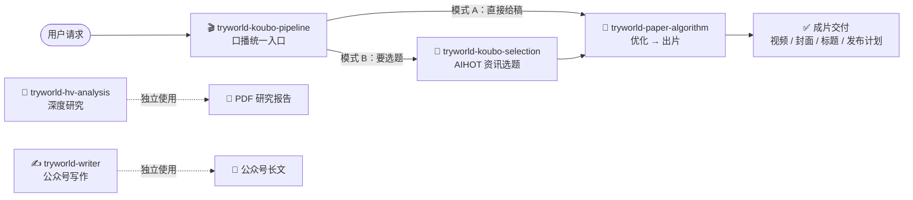

<h1 align="center">TryWorld Skills</h1>

<p align="center">
  <b>试界 TryWorld 的 Codex Skills 合集</b> —— 选题 · 写稿 · 出片 · 深度研究 · 公众号写作
</p>

<p align="center">
  
  
  
</p>

---

## 技能总览

| | 技能 | 一句话定位 | 核心产出 |
|---|---|---|---|
| 🎬 | [tryworld-koubo-pipeline](skills/tryworld-koubo-pipeline/) | 口播视频全流程**统一入口**,自动路由 | 从选题到成片的一站式交付 |
| 📜 | [tryworld-paper-algorithm](skills/tryworld-paper-algorithm/) | 「纸上算法」风格 AI 知识视频制作 | 主视频 · 横竖封面 · 平台标题 |
| 🎯 | [tryworld-koubo-selection](skills/tryworld-koubo-selection/) | 基于 AIHOT 最新 AI 资讯产出口播选题 | 3-8 个候选选题清单 |
| 🔬 | [tryworld-hv-analysis](skills/tryworld-hv-analysis/) | 横纵分析法深度研究 | 排版精美的 PDF 研究报告 |
| ✍️ | [tryworld-writer](skills/tryworld-writer/) | 公众号长文写作（试界风格） | 公众号长文 |

## 技能关系



口播链路只需记住 `$tryworld-koubo-pipeline` 一个入口：直接给稿走模式 A，要选题走模式 B，它会自动调度其余技能；`tryworld-hv-analysis` 与 `tryworld-writer` 相互独立，按需单独调用。

## 快速开始

每个技能文件夹都是独立的 Skill，复制到本机技能目录即可安装（Windows 示例）：

```powershell
# 安装全部技能
Copy-Item -Path .\skills\* -Destination "$env:USERPROFILE\.codex\skills" -Recurse

# 或只安装单个技能
Copy-Item -Path .\skills\tryworld-paper-algorithm -Destination "$env:USERPROFILE\.codex\skills" -Recurse
```

安装后在 Codex 会话中按技能名调用：

```text
用 $tryworld-koubo-pipeline 做一期口播视频。
```

## 目录结构

```text
tryworld-skills/
├── README.md                        # 本索引
└── skills/
    ├── tryworld-koubo-pipeline/     # 口播总入口（路由）
    ├── tryworld-paper-algorithm/    # 纸上算法视频制作
    ├── tryworld-koubo-selection/    # AIHOT 口播选题
    ├── tryworld-hv-analysis/        # 横纵分析法深度研究
    └── tryworld-writer/             # 公众号长文写作
```

## 许可

本仓库暂未附带开源许可证；在添加许可证之前，默认保留所有权利。
