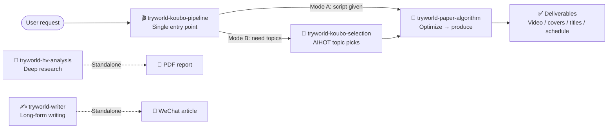

<h1 align="center">TryWorld Skills</h1>

<p align="center">
  <b>A collection of Codex Skills by 试界 TryWorld</b><br/>
  topic selection · scriptwriting · video production · deep research · long-form writing
</p>

<p align="center">
  
  
  
  
</p>

<p align="center">
  
  
  
  
  
  
</p>

<p align="center">
  <b><a href="README.md">English</a></b> · <a href="README.zh-CN.md">简体中文</a>
</p>

---

## Skills at a glance

| Icon | Skill | What it does | Key deliverables |
|---|---|---|---|
| 🎬 | [tryworld-koubo-pipeline](skills/tryworld-koubo-pipeline/) | **Single entry point** for the voiceover video workflow; auto-routes to the right skill | End-to-end delivery: topic → script → video → publishing plan |
| 📜 | [tryworld-paper-algorithm](skills/tryworld-paper-algorithm/) | Produces branded “Paper Algorithm” style AI knowledge videos | Main video, horizontal & vertical covers, platform titles |
| 🎯 | [tryworld-koubo-selection](skills/tryworld-koubo-selection/) | Picks video topics from the latest AIHOT AI news | 3–8 candidate topics with angles & source links |
| 🔬 | [tryworld-hv-analysis](skills/tryworld-hv-analysis/) | Deep research with Horizontal-Vertical Analysis | Polished PDF research report |
| ✍️ | [tryworld-writer](skills/tryworld-writer/) | Long-form WeChat article writing in TryWorld's style | Long-form article |

## How the skills fit together



For video work, just remember `$tryworld-koubo-pipeline`: give it a script (Mode A) or ask for topics (Mode B), and it routes to the other skills for you. `tryworld-hv-analysis` and `tryworld-writer` are standalone — call them directly when needed.

## Tech stack

| Skill | Built with |
|---|---|
| tryworld-paper-algorithm | HyperFrames, edge-tts (Azure YunxiNeural), FFmpeg, Node.js ≥ 22, Python 3.10+ |
| tryworld-koubo-selection | PowerShell script / curl, AIHOT API |
| tryworld-hv-analysis | Python, WeasyPrint, Markdown |
| tryworld-writer | — |
| tryworld-koubo-pipeline | Router on top of the skills above |

## Quick start

Every skill folder is a self-contained Skill. Copy it into your local skills directory (Windows example):

```powershell
# Install all skills
Copy-Item -Path .\skills\* -Destination "$env:USERPROFILE\.codex\skills" -Recurse

# Or install a single skill
Copy-Item -Path .\skills\tryworld-paper-algorithm -Destination "$env:USERPROFILE\.codex\skills" -Recurse
```

`~/.agents/skills` works on other hosts as well. Then call the skill by name:

```text
Use $tryworld-koubo-pipeline to make a video from this voiceover script.
```

## Repository layout

```text
tryworld-skills/
├── README.md                 # Index (English)
├── README.zh-CN.md           # Index (简体中文)
└── skills/
    ├── tryworld-koubo-pipeline/     # Voiceover workflow entry (router)
    ├── tryworld-paper-algorithm/    # Paper Algorithm video production
    ├── tryworld-koubo-selection/    # AIHOT topic selection
    ├── tryworld-hv-analysis/        # Horizontal-Vertical deep research
    └── tryworld-writer/             # WeChat long-form writing
```

## License

All rights reserved. No license is attached to this repository yet.
