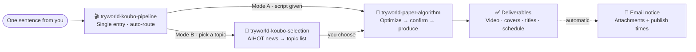

<p align="center">
  
</p>

<p align="center">
  <b>TryWorld · A Collection of Codex Skills</b><br/>
  topic selection · scriptwriting · video production · deep research · long-form writing
</p>

<p align="center">
  <b>English</b> · <a href="README.zh-CN.md">简体中文</a>
</p>

<p align="center">
  
  
  
  
</p>

---

> **A skill set built for content creation.** From "what should I make this week" to a finished video with covers, platform titles, a publishing plan, and an automatic email notification — plus deep research and long-form writing, all wrapped into skills you can invoke with plain language.

## ✨ Skills at a Glance

| | Skill | Role | Key Deliverables | Depends on |
|---|---|---|---|---|
| 🎬 | [tryworld-koubo-pipeline](skills/tryworld-koubo-pipeline/) | **Single entry** for the voiceover video workflow | Auto-routes: topic → script → optimize → video → email notice | Other skills · `qq-email` |
| 📜 | [tryworld-paper-algorithm](skills/tryworld-paper-algorithm/) | "Paper Algorithm" AI knowledge videos | Main video · covers · platform titles · captions | HyperFrames · edge-tts · FFmpeg |
| 🎯 | [tryworld-koubo-selection](skills/tryworld-koubo-selection/) | Topic selection from AI news | 3–8 candidates with angles & source links | AIHOT API |
| 🔬 | [tryworld-hv-analysis](skills/tryworld-hv-analysis/) | Horizontal–Vertical deep research | Polished PDF research report | Python · WeasyPrint |
| ✍️ | [tryworld-writer](skills/tryworld-writer/) | WeChat long-form writing | Long-form article in TryWorld style | — |

## 🎬 The Voiceover Workflow



For the video pipeline, remember one entry point: **`$tryworld-koubo-pipeline`**. Hand it a script (Mode A) or ask for topics (Mode B) — it routes the rest. `tryworld-hv-analysis` and `tryworld-writer` are standalone.

## 🎨 The Paper Algorithm Design System

TryWorld videos follow one visual contract — **scientific manuscript + Chinese print tradition**: paper is the stage, ink is the text, vermillion is the accent, and the seal is the signature.

| Swatch | Value | Role |
|---|---|---|
| Paper | `#F4EFE4` | Background |
| Ink | `#1C1916` | Text & lines |
| Vermillion | `#C0452F` | The only accent: keywords, numbers, seal |
| Ink Blue | `#2E5E8C` | Secondary notes & chart guides |

- **Type**: Noto Serif SC (headings) · LXGW WenKai / ZCOOL XiaoWei (notes) · monospace (data)
- **Motion**: ink drop · brush stroke · seal stamp — three signature moves throughout
- **Authenticity**: a vermillion "试界原创" seal stays in the top-right corner for the whole video

## 🚀 Quick Start

Each skill folder is self-contained. Copy it into your local skills directory:

```powershell
# Install all skills
Copy-Item -Path .\skills\* -Destination "$env:USERPROFILE\.codex\skills" -Recurse

# Or install a single skill
Copy-Item -Path .\skills\tryworld-paper-algorithm -Destination "$env:USERPROFILE\.codex\skills" -Recurse
```

`~/.agents/skills` works on other hosts too. Then just say it in Codex:

```text
Make me a TryWorld voiceover video
Use $tryworld-koubo-pipeline to produce this
```

## 🗂 Repository Layout

```text
tryworld-skills/
├── assets/hero.svg                 # Brand banner
├── README.md                       # Index (English)
├── README.zh-CN.md                 # Index (简体中文)
└── skills/
    ├── tryworld-koubo-pipeline/         # Voiceover entry (router + email notice)
    ├── tryworld-paper-algorithm/        # Paper Algorithm video production
    ├── tryworld-koubo-selection/        # AIHOT topic selection
    ├── tryworld-hv-analysis/            # Horizontal–Vertical deep research
    └── tryworld-writer/                 # WeChat long-form writing
```

## 🛠 Tech Stack

| Skill | Built with |
|---|---|
| tryworld-paper-algorithm | HyperFrames · edge-tts (Azure YunxiNeural) · FFmpeg · Node.js ≥ 22 · Python 3.10+ |
| tryworld-koubo-selection | PowerShell / curl · AIHOT API |
| tryworld-hv-analysis | Python · WeasyPrint · Markdown |
| tryworld-koubo-pipeline | Orchestrates the above · `qq-email` (SMTP / IMAP) |

## ⚖️ License

All rights reserved. Please do not redistribute until an open-source license is attached.

---

<p align="center"><sub>TryWorld · Making AI clear for everyone</sub></p>