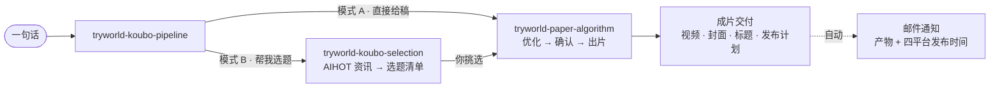

<p align="center">
  
</p>

<p align="right"><sub><a href="README.md">English</a> · 简体中文 · <a href="docs/index.html">HTML 版</a></sub></p>

---

<p align="center">
  <b>试界 TryWorld · Codex Skills 合集</b><br>
  <sub>五个技能，一条内容生产线：选题 · 写稿 · 出片 · 深度研究 · 公众号写作</sub>
</p>

## 这是什么

试界是一套面向 AI 内容生产的微型工作流系统。你只需要说一句人话，系统会自动判断：是直接进入生产链路，还是先做一轮选题；然后按能力边界分发到不同技能，输出完整交付物。

它的价值不是“又一个提示词集合”，而是把选题、写稿、出片、研究和写作收束成一套可重复执行的内容工厂。

## 技能

<details open>
<summary><b>01 · tryworld-koubo-pipeline</b> — 口播统一入口，自动路由</summary>

- 自动识别「直接给稿」（模式 A）与「要选题」（模式 B）；支持子命令「只要选题 / 只要写稿 / 只优化」；去重判定；成片交付后自动发邮件通知。
- 产出：全流程交付 · 邮件通知
- 依赖：调度其余技能 · `qq-email`

</details>

<details>
<summary><b>02 · tryworld-paper-algorithm</b> — 纸上算法视频制作</summary>

- 口播稿优化净化 → 云希配音 → HyperFrames 构图渲染 → 横竖封面 + 平台标题 + 字幕时间轴；右上角「试界原创」印章全程常驻。
- 产出：主视频 · 横竖封面 · 平台标题
- 依赖：HyperFrames · edge-tts · FFmpeg

</details>

<details>
<summary><b>03 · tryworld-koubo-selection</b> — AI 资讯选题</summary>

- 拉取 AIHOT 最新精选，按频道增长原理筛选题；每个选题带角度、素材原文链接与优先级；自动避开已做选题。
- 产出：3–8 个候选选题清单
- 依赖：AIHOT API · PowerShell / curl

</details>

<details>
<summary><b>04 · tryworld-hv-analysis</b> — 横纵分析法深度研究</summary>

- 纵轴追生命历程，横轴比竞品格局，交叉出独到洞察；产出排版精美的 PDF 研究报告。
- 产出：PDF 研究报告
- 依赖：Python · WeasyPrint · Markdown

</details>

<details>
<summary><b>05 · tryworld-writer</b> — 公众号长文写作</summary>

- 根据素材（PDF / 链接 / 语音转写 / 简报）写成试界风格公众号长文。
- 产出：公众号长文成品
- 依赖：—

</details>

## 工作流



口播链路只需记住一个入口：`$tryworld-koubo-pipeline`。`tryworld-hv-analysis` 与 `tryworld-writer` 独立使用。

## 设计系统 · 纸上算法

纸面是舞台，墨迹是文字，朱红是重点，印章是签名。

| 色 | 值 | 用途 |
|---|---|---|
| 纸面 | `#F4EFE4` | 背景主色 |
| 墨黑 | `#1C1916` | 主文字、线条 |
| 朱红 | `#C0452F` | 唯一强调色 |
| 墨水蓝 | `#2E5E8C` | 次级批注 |

字体：思源宋体 · 霞鹜文楷 · 等宽。动效：墨落纸、笔写入、盖章。

## 安装

每个技能文件夹都是独立 Skill，复制到本机技能目录即可：

```powershell
Copy-Item -Path .\skills\* -Destination "$env:USERPROFILE\.codex\skills" -Recurse
```

其他宿主可放 `~/.agents/skills`。安装后直接说：「帮我做一期口播」。

## 目录

```text
tryworld-skills/
├── assets/                  # hero、许可徽章
├── docs/index.html          # 完整 HTML 设计版
├── README.md                # English
├── README.zh-CN.md          # 简体中文
├── LICENSE                  # CC BY-NC 4.0
└── skills/                  # 五个技能
```

## 许可

知识共享 署名-非商业性使用 4.0 国际（CC BY-NC 4.0）：允许署名、非商业用途的自由分享与演绎，禁止商业用途。完整条款见 [LICENSE](LICENSE)。

[](https://creativecommons.org/licenses/by-nc/4.0/)

---

<p align="center"><sub>试界 TryWorld · 持续把 AI 讲清楚 — 排版：纸上算法 · MMXXVI</sub></p>
