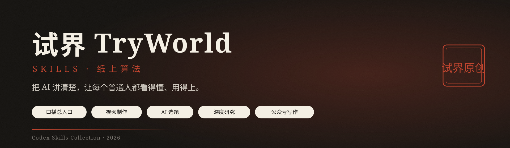
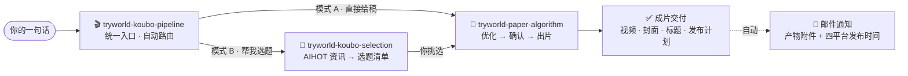

<p align="center">
  
</p>

<p align="center">
  <b>试界 TryWorld · Codex Skills 合集</b><br/>
  选题 · 写稿 · 出片 · 深度研究 · 公众号写作
</p>

<p align="center">
  <a href="README.md">English</a> · <b>简体中文</b>
</p>

<p align="center">
  
  
  
  
</p>

---

> **一套服务于内容创作的 Codex Skills。** 从「这周做什么选题」到「一条成片交付、附四平台发布计划、自动邮件通知」,再到深度研究与公众号长文——把高频创作流程沉淀为一句人话就能调用的技能。

## ✨ 技能一览

| | 技能 | 角色 | 核心产出 | 依赖 |
|---|---|---|---|---|
| 🎬 | [tryworld-koubo-pipeline](skills/tryworld-koubo-pipeline/) | 口播全流程**统一入口** | 自动路由：选题 → 写稿 → 优化 → 成片 → 邮件通知 | 调度其余技能 · `qq-email` |
| 📜 | [tryworld-paper-algorithm](skills/tryworld-paper-algorithm/) | 「纸上算法」AI 知识视频制作 | 主视频 · 横竖封面 · 平台标题 · 字幕时间轴 | HyperFrames · edge-tts · FFmpeg |
| 🎯 | [tryworld-koubo-selection](skills/tryworld-koubo-selection/) | AI 资讯选题 | 3-8 个候选选题（带素材与原文链接） | AIHOT API |
| 🔬 | [tryworld-hv-analysis](skills/tryworld-hv-analysis/) | 横纵分析法深度研究 | 排版精美的 PDF 研究报告 | Python · WeasyPrint |
| ✍️ | [tryworld-writer](skills/tryworld-writer/) | 公众号长文写作 | 试界风格长文 | — |

## 🎬 口播工作流



口播链路只需记住一个入口：**`$tryworld-koubo-pipeline`**。直接给稿走模式 A，要选题走模式 B，它会自动调度其余技能；`tryworld-hv-analysis` 与 `tryworld-writer` 相互独立，按需单独调用。

## 🎨 纸上算法 · 设计系统

试界视频的视觉契约——**科学手稿 + 中文印刷传统**：纸面是舞台，墨迹是文字，朱红是重点，印章是签名。

| 色板 | 值 | 用途 |
|---|---|---|
| 纸面 | `#F4EFE4` | 背景主色 |
| 墨黑 | `#1C1916` | 主文字、线条 |
| 朱红 | `#C0452F` | 唯一强调色：关键词、数字、印章 |
| 墨水蓝 | `#2E5E8C` | 次级批注、图表辅助线 |

- **字体**：思源宋体（主标题）· 霞鹜文楷 / ZCOOL 小薇（批注）· 等宽字体（数据）
- **动效**：墨落纸 · 笔写入 · 盖章——全片三种签名动效
- **防伪**：右上角朱红「试界原创」印章全程常驻

## 🚀 快速开始

每个技能文件夹都是独立 Skill，复制到本机技能目录即可安装：

```powershell
# 安装全部技能
Copy-Item -Path .\skills\* -Destination "$env:USERPROFILE\.codex\skills" -Recurse

# 或只安装单个技能
Copy-Item -Path .\skills\tryworld-paper-algorithm -Destination "$env:USERPROFILE\.codex\skills" -Recurse
```

其他宿主也可放到 `~/.agents/skills`。安装后在 Codex 会话中直接说：

```text
帮我做一期口播
用 $tryworld-koubo-pipeline 出片
```

## 🗂 目录结构

```text
tryworld-skills/
├── assets/hero.svg                 # 品牌横幅
├── README.md                       # 索引（English）
├── README.zh-CN.md                 # 索引（简体中文）
└── skills/
    ├── tryworld-koubo-pipeline/         # 口播总入口（路由 + 邮件通知）
    ├── tryworld-paper-algorithm/        # 纸上算法视频制作
    ├── tryworld-koubo-selection/        # AIHOT 口播选题
    ├── tryworld-hv-analysis/            # 横纵分析法深度研究
    └── tryworld-writer/                 # 公众号长文写作
```

## 🛠 技术栈

| 技能 | 依赖 |
|---|---|
| tryworld-paper-algorithm | HyperFrames · edge-tts（Azure YunxiNeural）· FFmpeg · Node.js ≥ 22 · Python 3.10+ |
| tryworld-koubo-selection | PowerShell / curl · AIHOT API |
| tryworld-hv-analysis | Python · WeasyPrint · Markdown |
| tryworld-koubo-pipeline | 调度上述技能 · `qq-email`（SMTP / IMAP） |

## ⚖️ 许可

本仓库采用 [知识共享 署名-非商业性使用 4.0 国际（CC BY-NC 4.0）](https://creativecommons.org/licenses/by-nc/4.0/)：允许署名、非商业用途的自由分享与演绎，**禁止商业用途**。

[](https://creativecommons.org/licenses/by-nc/4.0/)

---

<p align="center"><sub>试界 TryWorld · 持续把 AI 讲清楚</sub></p>
