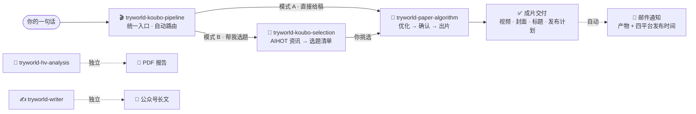

<p align="center">
  
</p>

<p align="center">
  <b>试界 TryWorld · Codex Skills 合集</b><br/>
  一套从选题到成片、再到深度研究的长文写作的完整创作工具链
</p>

<p align="center">
  <a href="README.md">English</a> · <b>简体中文</b>
</p>

<p align="center">
  
  
  
  
</p>

---

> **把 AI 讲清楚，让每个普通人都看得懂、用得上。** 五个技能各自解决创作链路中的一环，合在一起就是一条完整的口播内容生产线——从「这周做什么」到成片交付、自动邮件通知、四平台发布计划。

## ✨ 技能总览

| | 技能 | 角色 | 一句话 | 核心产出 |
|---|---|---|---|---|
| 🎬 | [tryworld-koubo-pipeline](skills/tryworld-koubo-pipeline/) | 口播**统一入口** | 一句人话，自动路由选题/写稿/优化/出片 | 全流程交付 + 邮件通知 |
| 📜 | [tryworld-paper-algorithm](skills/tryworld-paper-algorithm/) | 纸上算法视频制作 | 口播稿 → 品牌化横屏视频 | 主视频 · 横竖封面 · 标题 · 字幕 |
| 🎯 | [tryworld-koubo-selection](skills/tryworld-koubo-selection/) | AI 资讯选题 | 从 AIHOT 最新动态里筛值得做的选题 | 3-8 个候选选题清单 |
| 🔬 | [tryworld-hv-analysis](skills/tryworld-hv-analysis/) | 横纵分析法深度研究 | 纵向历程 × 横向竞品，双轴交叉出洞察 | 精美 PDF 研究报告 |
| ✍️ | [tryworld-writer](skills/tryworld-writer/) | 公众号长文写作 | 按试界风格把素材写成公众号长文 | 长文成品 |

## 🎬 口播工作流



口播链路只记一个入口：**`$tryworld-koubo-pipeline`**。给稿走模式 A，要选题走模式 B；`tryworld-hv-analysis` 与 `tryworld-writer` 独立使用。

## 🧩 技能详解

### 🎬 tryworld-koubo-pipeline — 口播总入口

> 整个口播流程的调度中枢。

- **能力**：自动识别"直接给稿"（模式 A）与"要选题"（模式 B）；子命令「只要选题 / 只要写稿 / 只优化不出片」；去重判定（扫描工作区成片）；成片交付后自动发邮件通知。
- **典型用法**：`帮我做一期口播` / `用 $tryworld-koubo-pipeline 出片`
- **依赖**：调度其余技能 · `qq-email`

### 📜 tryworld-paper-algorithm — 纸上算法视频制作

> 一页会动的算法笔记：纸面是舞台，墨迹是文字，朱红是重点，印章是签名。

- **能力**：口播稿优化净化 → 云希配音（Azure YunxiNeural）→ HyperFrames 构图渲染 → 横竖封面 + 平台标题 + 字幕时间轴；右上角「试界原创」印章全程常驻。
- **典型用法**：`$tryworld-paper-algorithm` 把这篇口播稿做成视频
- **依赖**：HyperFrames · edge-tts · FFmpeg · Node.js ≥ 22 · Python 3.10+

### 🎯 tryworld-koubo-selection — AI 口播选题

> 每天几百条 AI 新闻，压缩成 3-8 个"能做、能火、不重复"的选题。

- **能力**：拉取 AIHOT 最新精选（模型/产品/行业/论文/技巧），按频道增长原理筛选题，每个选题带角度、素材原文链接与优先级；自动避开已做选题。
- **典型用法**：`帮我选题` / `这周做什么口播`
- **依赖**：AIHOT API · PowerShell / curl

### 🔬 tryworld-hv-analysis — 横纵分析法深度研究

> 纵轴追生命历程，横轴比竞品格局，交叉出独到洞察。

- **能力**：系统研究产品/公司/概念/人物，产出排版精美的 PDF 研究报告。
- **典型用法**：`用横纵分析法研究一下 XX`
- **依赖**：Python · WeasyPrint · Markdown

### ✍️ tryworld-writer — 公众号长文写作

> 试界风格的公众号长文生产器。

- **能力**：根据素材（PDF / 链接 / 语音转写 / 简报）写成试界风格长文，含投稿邮箱引导。
- **典型用法**：`帮我把这个写成公众号文章`
- **依赖**：—

## 🎨 纸上算法 · 设计系统

试界视频的视觉契约——**科学手稿 + 中文印刷传统**。

| 色板 | 值 | 用途 |
|---|---|---|
| 纸面 | `#F4EFE4` | 背景主色 |
| 墨黑 | `#1C1916` | 主文字、线条 |
| 朱红 | `#C0452F` | 唯一强调色：关键词、数字、印章 |
| 墨水蓝 | `#2E5E8C` | 次级批注、图表辅助线 |

- **字体**：思源宋体（主标题）· 霞鹜文楷 / ZCOOL 小薇（批注）· 等宽字体（数据）
- **动效**：墨落纸 · 笔写入 · 盖章——全片三种签名动效
- **防伪**：右上角朱红「试界原创」印章全程常驻

## 🚀 快速开始

每个技能文件夹都是独立 Skill，复制到本机技能目录即可：

```powershell
# 安装全部技能
Copy-Item -Path .\skills\* -Destination "$env:USERPROFILE\.codex\skills" -Recurse

# 或只安装单个技能
Copy-Item -Path .\skills\tryworld-paper-algorithm -Destination "$env:USERPROFILE\.codex\skills" -Recurse
```

其他宿主也可放到 `~/.agents/skills`。安装后在 Codex 会话中直接说：

```text
帮我做一期口播
用 $tryworld-koubo-pipeline 出片
```

## 🗂 目录结构

```text
tryworld-skills/
├── assets/
│   ├── hero.svg                 # 品牌横幅
│   └── license-badge.svg        # 许可徽章
├── README.md                    # 索引（English）
├── README.zh-CN.md              # 索引（简体中文）
├── LICENSE                      # CC BY-NC 4.0
└── skills/
    ├── tryworld-koubo-pipeline/      # 口播总入口（路由 + 邮件通知）
    ├── tryworld-paper-algorithm/     # 纸上算法视频制作
    ├── tryworld-koubo-selection/     # AIHOT 口播选题
    ├── tryworld-hv-analysis/         # 横纵分析法深度研究
    └── tryworld-writer/              # 公众号长文写作
```

## 🛠 技术栈

| 技能 | 依赖 |
|---|---|
| tryworld-paper-algorithm | HyperFrames · edge-tts（Azure YunxiNeural）· FFmpeg · Node.js ≥ 22 · Python 3.10+ |
| tryworld-koubo-selection | PowerShell / curl · AIHOT API |
| tryworld-hv-analysis | Python · WeasyPrint · Markdown |
| tryworld-koubo-pipeline | 调度上述技能 · `qq-email`（SMTP / IMAP） |
| tryworld-writer | — |

## ⚖️ 许可

本仓库采用知识共享 **署名-非商业性使用 4.0 国际（CC BY-NC 4.0）**：允许署名、非商业用途的自由分享与演绎，禁止商业用途。完整条款见 [LICENSE](LICENSE)。

[](https://creativecommons.org/licenses/by-nc/4.0/)

---

<p align="center"><sub>试界 TryWorld · 持续把 AI 讲清楚 · 让每个普通人都看得懂、用得上</sub></p>